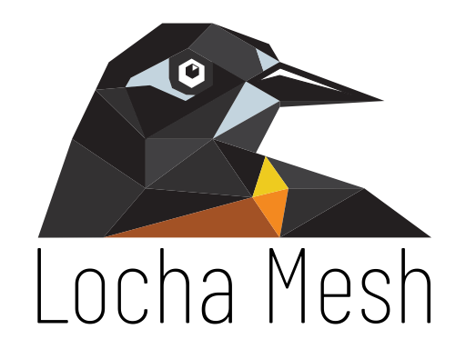

# locha-p2p

  
   
  

  <a href="https://locha.io/">Project Website</a> |
  <a href="https://locha.io/donate">Donate</a> |
  <a href="https://github.com/sponsors/rdymac">Sponsor</a> |
  <a href="https://locha.io/buy">Buy</a>

<h1 align="center">Locha P2P</h1>

This repository contains the building blocks for the P2P chat functionality
written in the [Rust] programming language.

[Rust]: https://www.rust-lang.org/

# License

Copyright (c) 2020 Bitcoin Venezuela and Locha Mesh Developers.

Licensed under the Apache License, Version 2.0

Unless required by applicable law or agreed to in writing, software distributed under the License is distributed on an "AS IS" BASIS, WITHOUT WARRANTIES OR CONDITIONS OF ANY KIND, either express or implied. See the License for the specific language governing permissions and limitations under the License.

Read the full text: [LICENSE](./LICENSE)